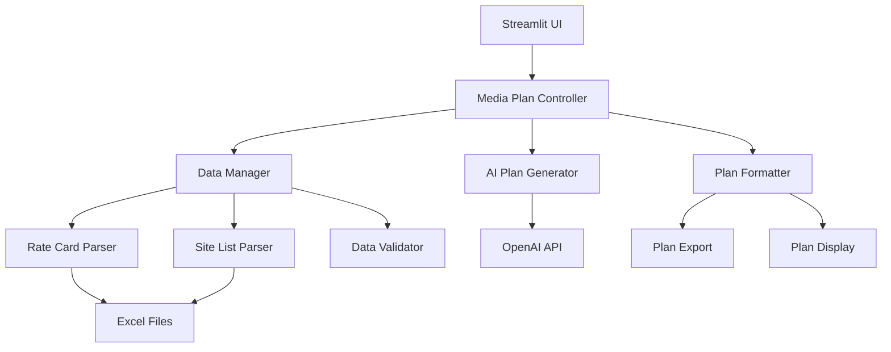

# Design Document

## Overview

The AI Media Planner is a Streamlit-based web application that enables media planners at Adzymic to generate intelligent, data-driven media plans for their clients. The system integrates with Excel-based rate cards and site lists to provide accurate pricing and placement recommendations, while leveraging OpenAI's GPT models to generate strategic media plan alternatives.

The application builds upon the existing `app_mpg.py` foundation but expands functionality to meet all specified requirements, including enhanced user experience, better data management, and more sophisticated plan generation capabilities.

## Architecture

### High-Level Architecture



### Component Architecture

The system follows a modular architecture with clear separation of concerns:

1. **Presentation Layer**: Streamlit UI components for user interaction
2. **Business Logic Layer**: Core media planning logic and AI integration
3. **Data Access Layer**: Excel file parsing and data validation
4. **External Services**: OpenAI API integration

## Components and Interfaces

### 1. User Interface Components

#### MediaPlannerForm
- **Purpose**: Collects client information and planning preferences
- **Inputs**: Brand name, budget, country, campaign period, objective, planning mode
- **Outputs**: Validated form data for plan generation
- **Key Features**:
  - Real-time budget validation
  - Dynamic country-based site filtering
  - Toggle between AI and manual product selection
  - Form validation with clear error messaging
  - **Future**: Audience segment selection and targeting options

#### PlanDisplayComponent
- **Purpose**: Renders generated media plans in user-friendly format
- **Inputs**: Generated plan data, formatting preferences
- **Outputs**: Formatted plan display with comparison features
- **Key Features**:
  - Side-by-side plan comparison
  - Interactive budget breakdown charts
  - Expandable plan details
  - Export functionality

### 2. Business Logic Components

#### MediaPlanController
- **Purpose**: Orchestrates the media planning workflow
- **Methods**:
  - `generate_plans(client_data, preferences)`: Main plan generation workflow
  - `validate_inputs(form_data)`: Input validation and sanitization
  - `compare_plans(plans)`: Plan comparison and ranking logic
- **Dependencies**: DataManager, AIPlanGenerator, PlanFormatter

#### AIPlanGenerator
- **Purpose**: Interfaces with OpenAI to generate strategic media plans
- **Methods**:
  - `create_system_prompt(market_data, constraints)`: Dynamic prompt generation
  - `generate_multiple_plans(brief, count=3)`: Generate specified number of plans
  - `optimize_plan_diversity()`: Ensure plan variety and strategic differences
  - `use_finetuned_model()`: Switch between base and fine-tuned OpenAI models
  - **Future**: `incorporate_audience_targeting()`: Include audience segments in plan optimization
- **Key Features**:
  - Context-aware prompt engineering
  - Plan diversity algorithms
  - Budget optimization logic
  - Industry best practices integration
  - Fine-tuned model integration for cost optimization
  - **Future**: Audience-based format recommendations and targeting optimization

### 3. Data Management Components

#### ModelTrainingManager
- **Purpose**: Manages fine-tuning data collection and model training workflows
- **Methods**:
  - `collect_training_data()`: Gather historical campaign briefs and successful plans
  - `format_for_openai()`: Convert data to OpenAI fine-tuning format
  - `initiate_fine_tuning()`: Start OpenAI fine-tuning job
  - `monitor_training_progress()`: Track training status and metrics
  - `deploy_fine_tuned_model()`: Switch to using fine-tuned model
- **Key Features**:
  - Automated data collection from historical plans
  - Data quality validation and formatting
  - Training job management and monitoring
  - A/B testing between base and fine-tuned models

#### DataManager
- **Purpose**: Centralized data access and management
- **Methods**:
  - `load_rate_cards()`: Parse and cache rate card data
  - `load_site_lists()`: Parse and cache site categorization data
  - `get_market_data(country)`: Retrieve country-specific data
  - `validate_data_freshness()`: Check data currency and completeness
  - **Future**: `load_audience_segments()`: Parse audience targeting data
- **Key Features**:
  - Automatic data caching
  - Data validation and error handling
  - Multi-market support
  - Real-time data refresh capabilities
  - **Future**: Audience segment integration and targeting optimization

#### RateCardParser
- **Purpose**: Parse Excel rate card files into usable data structures
- **Methods**:
  - `parse_impact_rates(file_path)`: Extract APX Impact pricing
  - `parse_reach_rates(file_path)`: Extract Reach Media pricing
  - `validate_rate_structure()`: Ensure data integrity
- **Supported Formats**: Excel files with multiple sheets, flexible column structures

#### SiteListParser
- **Purpose**: Parse site categorization Excel files
- **Methods**:
  - `parse_by_market(market_code)`: Extract market-specific sites
  - `categorize_sites()`: Group sites by format and category
  - `validate_site_data()`: Ensure completeness and accuracy

## Data Models

### ClientBrief
```python
@dataclass
class ClientBrief:
    brand_name: str
    budget: float
    country: str
    campaign_period: str
    objective: str
    planning_mode: str
    selected_formats: Optional[List[str]] = None

### TrainingData
```python
@dataclass
class TrainingData:
    campaign_brief: str
    generated_plan: str
    performance_metrics: Optional[Dict[str, float]]
    created_at: datetime
    validated: bool

@dataclass
class FineTuningJob:
    job_id: str
    model_name: str
    training_file_id: str
    status: str
    created_at: datetime
    completed_at: Optional[datetime]
    fine_tuned_model: Optional[str]
```

### MediaPlan
```python
@dataclass
class MediaPlan:
    plan_id: str
    title: str
    total_budget: float
    allocations: List[FormatAllocation]
    estimated_reach: int
    estimated_impressions: int
    rationale: str
    created_at: datetime
```

### FormatAllocation
```python
@dataclass
class FormatAllocation:
    format_name: str
    budget_allocation: float
    cpm: float
    estimated_impressions: int
    recommended_sites: List[str]
    notes: str
```

### RateCard
```python
@dataclass
class RateCard:
    market: str
    format_rates: Dict[str, float]
    last_updated: datetime
    reach_tiers: Dict[str, float]
```

### SiteData
```python
@dataclass
class SiteData:
    market: str
    sites_by_format: Dict[str, List[str]]
    categories: Dict[str, List[str]]
    last_updated: datetime

### AudienceSegment (Future Enhancement)
```python
@dataclass
class AudienceSegment:
    segment_id: str
    name: str
    demographics: Dict[str, Any]
    interests: List[str]
    market: str
    estimated_size: int
    recommended_formats: List[str]
    
@dataclass
class TargetingData:
    primary_segment: AudienceSegment
    secondary_segments: List[AudienceSegment]
    overlap_analysis: Dict[str, float]
```

## Error Handling

### Data Validation Errors
- **Missing Rate Cards**: Display clear error message with upload instructions
- **Outdated Data**: Warning indicators with refresh recommendations
- **Invalid Budget**: Real-time validation with suggested ranges
- **Unsupported Markets**: Clear messaging with available market list

### API Integration Errors
- **OpenAI API Failures**: Graceful fallback with retry mechanisms
- **Rate Limiting**: Queue management and user notifications
- **Network Issues**: Offline mode with cached data where possible

### User Input Errors
- **Form Validation**: Real-time feedback with specific error messages
- **File Upload Issues**: Clear instructions and format requirements
- **Export Failures**: Alternative export formats and troubleshooting

## Testing Strategy

### Unit Testing
- **Data Parsers**: Test with various Excel file formats and edge cases
- **Plan Generation Logic**: Mock AI responses to test business logic
- **Validation Functions**: Comprehensive input validation testing
- **Calculation Accuracy**: Verify budget allocation and impression calculations

### Integration Testing
- **OpenAI API Integration**: Test with various prompt scenarios
- **Excel File Processing**: Test with real rate card and site list files
- **End-to-End Workflows**: Complete user journey testing
- **Data Refresh Scenarios**: Test automatic and manual data updates

### User Acceptance Testing
- **Media Planner Workflows**: Test with actual Adzymic team members
- **Plan Quality Assessment**: Validate AI-generated plan quality
- **Performance Testing**: Ensure responsive performance with large datasets
- **Cross-Browser Compatibility**: Test Streamlit app across browsers

### Performance Testing
- **Large File Processing**: Test with comprehensive rate cards and site lists
- **Concurrent Users**: Simulate multiple media planners using the system
- **API Response Times**: Monitor and optimize OpenAI integration performance
- **Memory Usage**: Ensure efficient data caching and processing
- **Model Performance**: Compare base vs fine-tuned model quality and speed
- **Training Pipeline**: Test fine-tuning data collection and model training workflows

## Security Considerations

### API Key Management
- Secure storage of OpenAI API keys using Streamlit secrets
- Environment-based configuration for different deployment stages
- Regular API key rotation procedures

### Data Privacy
- Client data handling and storage policies
- Temporary data cleanup after plan generation
- Compliance with data protection regulations

### File Upload Security
- Validation of Excel file formats and content
- Sanitization of file names and paths
- Size limits and malware scanning considerations